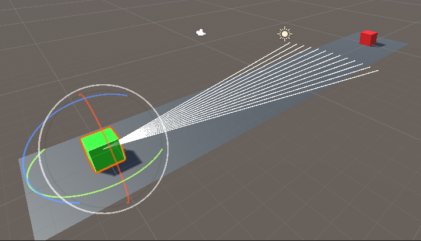
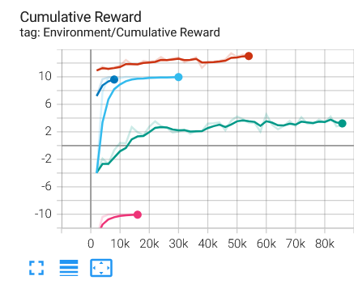
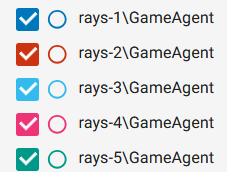

# ML-Agents Deel 3: Jumper

## Components

- **Setup**: long plane, agent and obstacle generator on opposite sides:
  - **Agent**: 3d rays perception, rigidbody, box collider;
  - **Obstacle generator**: box collider. Continually spawns clones of itself, and slides them towards the agent at a constant speed, randomly determined per episode.
- **Goal**: the agent jumps over the obstacles.
- **Agent reward function**:
  - -5 for touching an obstacle (episode ends);
  - -0.01 for every airborne step;
  - +2 for jumping over an obstacle (episode ends at cumulative reward >=5).
- **Behavior parameters**:
  - **Vector observations**: 3 parameters, for detecting position of one ray intersecting obstacle;
  - **Actions**: continuous action, for values >= 1 causing the agent to jump;
  - **Visual observations**: none.
- **Float properties**:
  - **Jump force**: specifies the amount of force applied to agent's rigidbody when it wants to jump (tested with 3.5);
  - **Target velocity range**: determines the range of randomly generated obstacle speed (tested with 0.1-0.35);
  - **Obstacle spawn distance multiplier**: influences speed at which obstacle generator generates obstacles, mainly determined by distance from spawn location to last spawned object (tested with 125).
- **Benchmark mean reward**: 

## Tensorboard graph

| Graph | Key |
| :-: | :-: |
|  |  |

## Training process

First run was mainly to see if my setup worked, hence the small amount of steps.  
Second run was adjusting some parameters and sticking with the ones that yielded gain.  
Third run was after the completion of the obstacle generator logic. It was here that I noticed a fatal flaw in the agent reward function: I was awarding the agent score for touching an obstacle instead of subtracting it. Hence the rapid plateau at 10, noticeable in the rays-3 graph: it didn't take much for the agent to figure out that letting the obstacle run into it gets a high score.  
Fourth run was directly after fixing this bug.
Fifth run was after slightly adjusting some parameters and sticking to the ones that yielded optimal gain.

My current agent completes its trained task fairly well, but only struggles when obstacles move at a very slow velocity. In that case, it doesn't wait long enough to jump and ends up jumping on top of the obstacle.

## Video

Link: [Panopto](https://ap.cloud.panopto.eu/Panopto/Pages/Viewer.aspx?id=d3f27877-ef1e-42fd-9aec-b2db00ca3b45).
